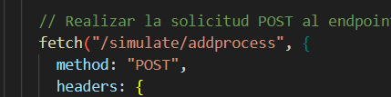
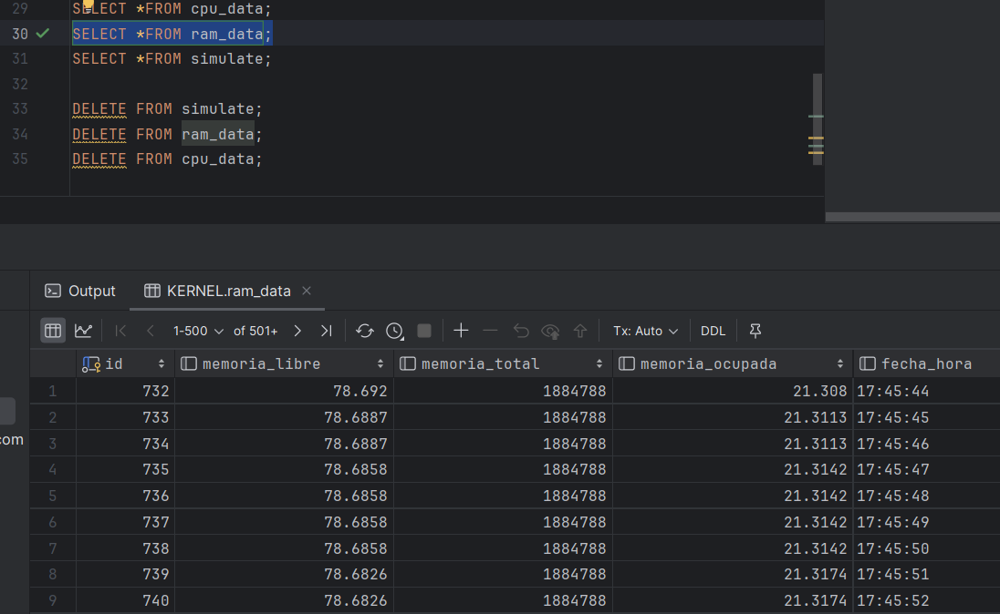

# PROYECTO 1
---
---

Acontinuacion se tendra el desarrollo de la Practica No. 1 de SO1

### Enlace de Enunciado
[](./Img/[SO1]PROYECTO1_1S2024.pdf)

---
---

___
## :large_orange_diamond: Scrip de la base de datos :large_orange_diamond:


___

___
## :large_orange_diamond: Composicion del BD :large_orange_diamond:


___

___
## :large_orange_diamond: Como se conecta la BD con Go :large_orange_diamond:


___

___
## :large_orange_diamond: Como se conecta la BD con Go :large_orange_diamond:


___

___
## :large_orange_diamond: Las GoRuntimes que se ejecutaron y los endpoint:large_orange_diamond:


___

___
## :large_orange_diamond: Archivo DockerFile de Go y su .dockerignore :large_orange_diamond:


___

___
## :large_orange_diamond: Archivo docker-compose :large_orange_diamond:


___

___
## :large_orange_diamond: Composicion del Backend :large_orange_diamond:


___

___
## :large_orange_diamond: Composicion del Frontend :large_orange_diamond:


___


___
## :large_orange_diamond: Archivos de componentes :large_orange_diamond:


___

___
## :large_orange_diamond: Archivos de componentes :large_orange_diamond:


### archivo app.js con las rutas de los componentes


### endpoints en los archivos del frontend





___

___
## :large_orange_diamond: Archvio de nginx :large_orange_diamond:


___

___
## :large_orange_diamond: Estructura del nginx :large_orange_diamond:


___

___
## :large_orange_diamond: Estructura del CPU :large_orange_diamond:


### composicion del archivo 


___

___
## :large_orange_diamond: Estructura del RAM :large_orange_diamond:


### composicion del archivo 


___


___
## :large_orange_diamond: Virtualizacion de Ubuntu Server 22.04 :large_orange_diamond:


### por conveniencia se conecto con termius tambien para poder hacer funciones como ctrl+v y ctrl+c XD


___

___
## :large_orange_diamond: Ejecucion de comandos :large_orange_diamond:

### docker-compose up - start - stop 


### comando para ver qeu esta hacineod mi docker-compose osea para pasarlo a primer plano 


### hacemos el uso de tag para subir los contenedores y docker push


### iniciamos nuevamente el servicio
 
___


___
## :large_orange_diamond: Mostramos como funciona la pagina :large_orange_diamond:


___

___
## :large_orange_diamond: Mostramos los datos almacenados :large_orange_diamond:



___


___
___

### COMANDOS UTILIZADOS

```javascript
//Para detener la ejecion de un contenedor donde ID es la CONTAINER ID vista en docker ps
make 
sudo insmod cup.ko
sudo insmod ram.ko
sudo rmmod cup
sudo rmmod ram

sudo docker-compose up
sudo docker-compose stop
sudo docker-compose down
sudo docker-compose start
docker-compose -f docker-compose.yml logs -f

sudo docker push henrrybran/backend-backend
sudo docker push henrrybran/backend-frontend
sudo docker push henrrybran/mysql


```

___