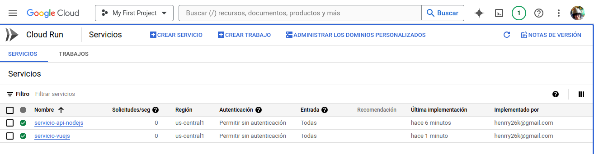

# EXPLICACION DE PROYECTO 2

# probamos lo de locust

levantamos locust con este comando

```javascript
# instalamos locust de forma global esto se hace afuera en cmd

sudo apt install python3-locust

# instalamos de manera local

pip3 install locust

# ejecutamos locust

locust -f traffic.py

```


Todo esto lo hacemos en la carpeta de locust del servicio1, ahi esta el archivo python y lo que se le cambio generalmente es el nombre del archivo json que se cargara en la linea 29 el album.json

---

# probamos lo de gRPC

levantamos los servicios de gRPC

```javascript
# instalamos el compilador de protobuf esto se hace afuera en cmd

sudo apt install protobuf-compiler

# Como exiten cliente y servidor se instalan los paquetes que necesitan ambos proyectos

go get github.com/gofiber/fiber/v2

go get google.golang.org/grpc

go install google.golang.org/protobuf/cmd/protoc-gen-go@latest

go install google.golang.org/grpc/cmd/protoc-gen-go-grpc@latest

# Ejecutamos el gRPC para que nos cree los archivos estos son los que estan dentro de las carpetas client y server

protoc --go_out=. --go-grpc_out=. client.proto

protoc --go_out=. --go-grpc_out=. server.proto

# creamos ejecutables

go build grpcClient

go build grpcServer

# ejecutamos los archivos anteriores

./grpcClient

./grpcServer


# Creamos sus imagenes de grpcClient y grpcServer

docker build -t henrrybran/grpcclient:latest .

docker build -t henrrybran/grpcserver:latest .

# Subimos las imagenes a dockerhub previamente hecho el login

docker push henrrybran/grpcclient:latest

docker push henrrybran/grpcserver:latest

```


Basicamente instalamos los paquetes en los main de cada archivo y cambiamos la estructura a favor del json que estamos enviando, y tambien se esta mostrando el contenido, tambien para ejecutar el cliente y servidor hay que crear sus ejecutables y sus imagenes de docker las subimos.

---

# creamos nuestro kubernete en la area que especificamos

instalamos el sdk de gcloud


definimos una zona 


creamos nuestro cluster


mostramos nuestra zona y nuestro cluester creado


# creamos nuestro namespace

sopes1

```javascript
kubectl create ns sopes1
```

nota:mantener el mismo namespace en todo para que no haya problemas de conexion

---

# creamos nuestro servidor de kafka

```javascript
kubectl create -f 'https://strimzi.io/install/latest?namespace=sopes1' -n sopes1
kubectl apply -f https://strimzi.io/examples/latest/kafka/kafka-persistent-single.yaml -n sopes1
```

nota: levantamos el zookepper, brokers y otra

# Antes de ejecutar obiamente necesitamos crear los dockerfile estos se encuentran en cada carpeta

estos los creamos siempre con los comandose especificos y los subimos

```javascript

# Creamos sus imagenes de grpcClient y grpcServer

docker build -t henrrybran/<nombre_imagen>:latest .

# Subimos las imagenes a dockerhub previamente hecho el login

docker push henrrybran/<nombre_imagen>:latest

```


# ejecutamos los secrets del consumidor de kafka

```javascript
kubectl apply -f ./secrets/

kubectl apply -f ./deployments/

kubectl apply -f ./services/

kubectl apply -f ./ingress/

```

# levantamos los secrets de primero

# Creamos el producto y consumdor de kafka

```javascript
# Creamos las imagenes
docker build -t henrrybran/producer:latest .

docker build -t henrrybran/consumer:latest .

# Subimos las imagenes

docker push henrrybran/producer:latest

docker push henrrybran/consumer:latest

```

Basicamente en esta parte hacemos la conexion de productores y consumidores con kafka se instalan los paquetes.

# En este punto instalamos kafka

# Para redis

```javascript
kubectl exec -it -n sopes1 redis-6fbbbc7b97-c9vtw -- bash
root@redis-6fbbbc7b97-c9vtw:/data# redis-cli
127.0.0.1:6379> AUTH YOUR_PASSWORD
OK
127.0.0.1:6379> keys *
1) "total"
2) "Banda"
3) "Ranked"
127.0.0.1:6379>
```

# Intalacion de la api Node js

```javascript
# Creamos las imagenes
docker build -t henrrybran/apinodejs:latest .

docker build -t henrrybran/vauweb:latest .

# Subimos las imagenes

docker push henrrybran/apinodejs:latest

docker push henrrybran/vauweb:latest

```
# Para la instalacion de grafana y redis y mongo

para la instalcion de estos componente se necesita simplemente los archivos yaml que ya tenemos hechos y que se encuentran en la carpeta deployments, secrets y services

```javascript
kubectl apply -f ./secrets/

kubectl apply -f ./deployments/

kubectl apply -f ./services/
```

y para la conexion de grafana con redis hay que hacer este cambio 


# Cremos nuestras dos cloudrun



# Mostramos nuestra pagina de vue js


# Se realizan unas pruebas al sistema de kubernetes tanto los productores como api node js de cloud run


# Mostramos nuestros pods creados


# Mostramos nuestros servicios creados


# Mostramos nuestros confimap creados


# Mostramos nuestros secrets creados


# Mostramos nuestros ingress creados


# Mostramos como funciona la app

ingresamos a locust


despues ingresamos a nuestra pagina cloudrun


por ultimo ingresamos a grafana


