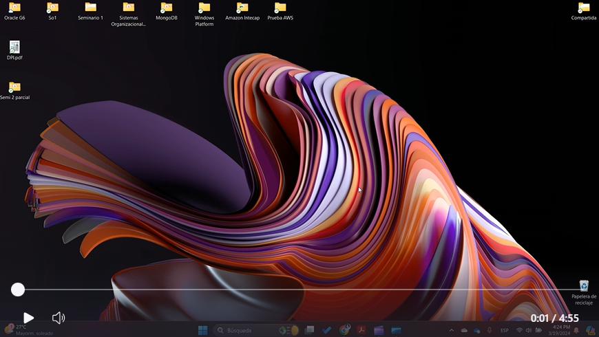

# Tarea No. 3 SO1

---
---

Acontinuacion se tendra el desarrollo de la tarea No. 3 de SO1

## Video de Demostración de Docker :movie_camera:

### Enlace al Video con Miniatura
[](https://www.youtube.com/watch?v=R9ITe2oTNgY)

### otros-Links :link:

1. [Enunciado de la Tarea](./Img/SO1_T3_1S2024.pdf)
2. [Link de Video(por si no fuciona el de arriba)](https://www.youtube.com/watch?v=R9ITe2oTNgY)

---
---

## Archivo de node js

```javascript
const redis = require('redis');

const client = redis.createClient({
    host: '10.159.202.6',
    port: 6379 
});

client.on('error', function (err) {
    console.error('Error de conexión a Redis:', err);
});

const message = { msg: "Hola a todos" };

client.publish('test', JSON.stringify(message), (err) => {
    if (err) {
        console.error('Error al publicar el mensaje:', err);
    } else {
        console.log('Mensaje publicado con éxito en el canal test.');
    }
    client.quit();
});

```

## Archivo de python

```javascript
import redis

redis_host = '10.159.202.6'

r = redis.Redis(host=redis_host, port=6379)

pubsub = r.pubsub()
pubsub.subscribe('test')

print('Esperando mensajes...')

for message in pubsub.listen():
    if message['type'] == 'message':
        print('Mensaje recibido:', message['data'])


```

## Comandos mas utilizados

Entre los comandos que utilize para esta tarea estan los siguientes

```javascript

//Para las VM
sudo apt-get udate
sudo apt-get upgrade 

//Para node js
sudo apt install curl -y
sudo apt policy nodejs
curl -fsSL https://deb.nodesource.com/setup_current.x | sudo -E bash -
sudo apt-get install nodejs
node -v
npm -v

//CREAMOS UNA CARPETA NODEJS
npm init
npm install redis
npm install nodemon --save -dev

//esto al package.json
"scripts": {
    "start": "nodemon publisher.js" // Este es el nuevo script de inicio
  },

npm start

//CREAMOS UNA CARPETA PYTHONCLIENT
//para python
sudo apt install python3-pip
pip install redis
python subscriber.py

```