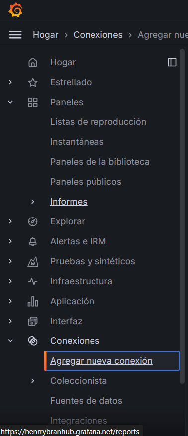
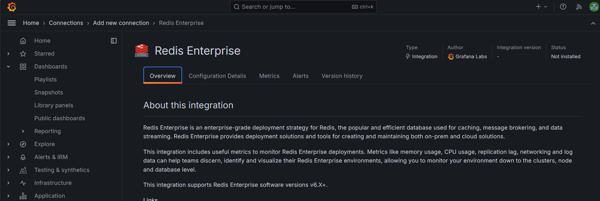

# Tarea No. 5 SO1

---

---

Realizar un ensayo sobre Grafana: qué es, como realizar dashboards y como conectar con redis.

___

## Grafana :movie_camera:

___

### ¿Que es Grafana?

Grafana es una herramienta de visualización de datos que permite crear dashboards personalizados a partir de diversos orígenes de datos. Fue desarrollado originalmente para visualizar métricas de tiempo real, pero ha evolucionado para admitir una amplia gama de fuentes de datos, como bases de datos, sistemas de monitoreo, registros y mucho más.

Grafana se destaca por su interfaz intuitiva y su capacidad para crear visualizaciones atractivas y fáciles de leer. Admite una variedad de paneles, como gráficos de líneas, gráficos de barras, gráficos de dispersión, tablas, entre otros. Estos paneles se pueden personalizar con diferentes opciones de estilo, colores y configuraciones.

___

### ¿Como realizar dashboards?

Los dashboards en Grafana son la forma principal de visualizar y organizar los datos. Un dashboard consta de uno o más paneles que muestran diferentes métricas o visualizaciones. Grafana ofrece una interfaz de arrastrar y soltar para facilitar la creación y personalización de dashboards.

Para crear un dashboard, sigue estos pasos:

1. Agregar una fuente de datos: Antes de crear un dashboard, debes configurar una fuente de datos en Grafana. Esto puede ser una base de datos, un sistema de monitoreo o cualquier otro origen de datos compatible.
2. Crear un nuevo dashboard: En la interfaz de Grafana, haz clic en el botón "Crear" y selecciona "Dashboard" para iniciar un nuevo dashboard en blanco.
3. Agregar paneles: En el nuevo dashboard, puedes agregar paneles haciendo clic en el botón "Agregar un nuevo panel". Grafana te permitirá seleccionar el tipo de panel (gráfico, tabla, etc.) y la fuente de datos correspondiente.
4. Personalizar los paneles: Una vez que hayas agregado un panel, puedes personalizarlo ajustando las configuraciones, como el tipo de gráfico, las unidades de medida, los colores, las leyendas y más.
5. Organizar y personalizar el dashboard: Puedes arrastrar y soltar los paneles para reorganizarlos dentro del dashboard. Además, puedes ajustar el tamaño de los paneles y configurar otras opciones de diseño.
6. Configurar alertas: Una característica importante de Grafana es su capacidad para configurar alertas basadas en umbrales predefinidos. Esto permite a los usuarios recibir notificaciones cuando los datos superan ciertos límites, lo que facilita la detección y respuesta rápida a problemas potenciales.
7. Guardar el dashboard: Cuando hayas terminado de configurar tu dashboard, asegúrate de guardarlo para poder acceder a él posteriormente.

Nota: La mayoria de datos o info esta en el panel izquierdo 

___

### ¿Como conectar grafana con Redis?

Redis es una base de datos en memoria de código abierto, utilizada ampliamente como caché y almacén de estructura de datos. Grafana puede conectarse a Redis para visualizar y monitorear las métricas relacionadas con su rendimiento y uso.

Para conectar Grafana con Redis, sigue estos pasos:

1. Instalar el plugin de Redis para Grafana: Grafana cuenta con un plugin oficial para Redis que permite la conexión y visualización de datos. Puedes instalarlo desde la sección de plugins en la interfaz de Grafana.
2. Configurar la fuente de datos: Después de instalar el plugin, debes configurar Redis como una fuente de datos en Grafana. Proporciona la información de conexión, como la dirección IP, el puerto y las credenciales de autenticación (si es necesario).
3. Crear consultas para los paneles: En los paneles de tu dashboard, puedes crear consultas utilizando la sintaxis específica del plugin de Redis. Estas consultas recuperarán los datos que deseas visualizar, como el uso de memoria, las estadísticas de conexión, las tasas de transferencia, entre otros.
4. Personalizar las visualizaciones: Una vez que hayas creado las consultas, puedes personalizar las visualizaciones de los paneles según tus necesidades. Puedes elegir diferentes tipos de gráficos, ajustar los colores, agregar umbrales de alerta y más.
5. Guardar y monitorear el dashboard: Finalmente, guarda tu dashboard y podrás monitorear continuamente el rendimiento y el estado de tu instancia de Redis a través de las visualizaciones creadas.

[Link de redis]([https://henrrybranhub.grafana.net/connections/add-new-connection/redis?page=alloy])

### otros-Links :link:

1. [Enunciado de la Tarea](./Img/SO1_T4_1S2024.pdf)

---

---
